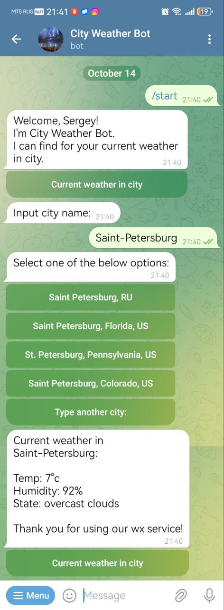

<h1 align="center"> Telegram Bot <br>"City Weather Bot" </h1>
<p align="center">

</p>

### Description  ###

This is telegram bot assistant which provides current weather in 
selected city for any country.<br>
Bot provides live data from https://openweathermap.org/

### Functions ###

Bot provide current weather for selected city.

### Features ###

Bot is:

- Providing current weather condition.
- User friendly.
- Easy to launch.

### Project Stack ###

- Python 3.12
- TelegramBotAPI
- Docker Compose
- Docstring and Type Hints

### Getting started 

This app is easy to start. Follow  the bellow requirements for Linux (Ubuntu): 


#### Clone repository
- From command line:
```
git clone from https://github.com/ssergey-92/telegram_weather_bot.git
```

#### Add .env file

Create .env as per .env.template and insert required data.
- Register and get API key from [openweathermap](https://openweathermap.org/).
- Register new telegram bot and get Bot token from [Telegram BotFather](https://telegram.me/BotFather).

#### Running the application:

- From command line: 
```
cd 'your path to project root directory'
docker compose up --build
```

### Developer ###

This telegram weather bot was developed by Sergey Solop.  
Contact email for suggestions and feedbacks solop1992@mail.ru